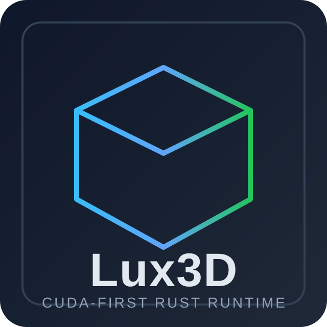
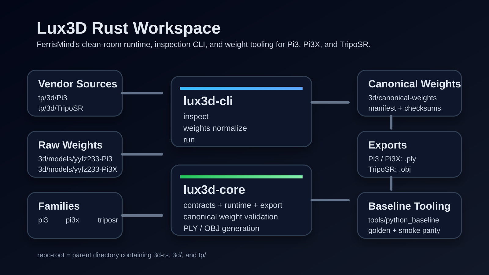

<p align="left">
  <a href="README.md"></a>
  <a href="README.RU.md"></a>
  <a href="README.PT_BR.md"></a>
</p>

---

<p align="center">
  
</p>

<p align="center">
  <b>Rust workspace for clean-room 3D inference, contract inspection, and weight canonicalization.</b><br>
  CUDA-first runtime for Pi3, Pi3X, and TripoSR.
</p>

<p align="center">
  
  
  
</p>

<h1 align="center">Lux3D</h1>

<p align="center">
  
</p>

## Table of Contents

- [What is this?](#what-is-this)
- [Key Features](#key-features)
- [Repository Layout](#repository-layout)
- [Quick Start](#quick-start)
- [System Requirements](#system-requirements)
- [License](#license)

## What is this?

Lux3D is a Rust 2024 workspace that provides:

- a Candle-first inference runtime
- contract inspection for supported model families
- canonical weight normalization and validation
- geometry export tooling for point clouds and meshes

Supported model families:

- `pi3`
- `pi3x`
- `triposr`

## Key Features

- `lux3d-core` implements contracts, runtime loading, export logic, and weight validation.
- `lux3d-cli` exposes `inspect`, `weights normalize`, and `run`.
- Python baseline tooling lives in [`tools/python_baseline/README.md`](tools/python_baseline/README.md).
- Model-family-specific licensing can be inspected through the CLI before redistribution.

## Repository Layout

| Path | Purpose |
|------|---------|
| `crates/lux3d-core` | Core runtime, contracts, geometry/export code, and weight validation |
| `crates/lux3d-cli` | CLI front-end for inspection, normalization, and inference runs |
| `tools/python_baseline` | Python parity tooling and canonical-weight normalization scripts |
| `.github/assets` | Project documentation assets |

## Quick Start

### Workspace Checks

```powershell
cargo metadata --no-deps
cargo run -p lux3d-cli -- --help
```

### Inspect Contracts

```powershell
cargo run -p lux3d-cli -- inspect --repo-root <runtime-root> pi3
cargo run -p lux3d-cli -- inspect --repo-root <runtime-root> pi3x
cargo run -p lux3d-cli -- inspect --repo-root <runtime-root> triposr
```

### Normalize Canonical Weights

```powershell
cargo run -p lux3d-cli -- weights normalize --repo-root <runtime-root> pi3
cargo run -p lux3d-cli -- weights normalize --repo-root <runtime-root> pi3x
cargo run -p lux3d-cli -- weights normalize --repo-root <runtime-root> triposr
```

### Run Inference

```powershell
# Pi3 -> PLY
cargo run -p lux3d-cli -- run --repo-root <runtime-root> pi3 --source <input-sequence> --output <output-file.ply>

# Pi3X core -> PLY
cargo run -p lux3d-cli -- run --repo-root <runtime-root> pi3x --source <input-sequence> --conditions <conditions-file> --output <output-file.ply>

# Pi3X VO -> PLY
cargo run -p lux3d-cli -- run --repo-root <runtime-root> pi3x --source <input-video> --vo --chunk-size 8 --overlap 4 --conf-threshold 0.05 --inject-condition pose,depth,ray --output <output-file.ply>

# TripoSR -> OBJ
cargo run -p lux3d-cli -- run --repo-root <runtime-root> triposr --source <input-image> --mc-resolution 256 --mc-threshold 25.0 --output <output-file.obj>
```

## System Requirements

- Rust 1.85 or newer
- Cargo with support for `edition = "2024"`
- Python 3.x for baseline tooling and normalization
- CUDA-capable NVIDIA hardware for verified runtime inference
- External model assets prepared in your local runtime environment

## License

The code and documentation in this repository are licensed under Apache 2.0. See [LICENSE](LICENSE).

Upstream model assets and canonicalized model artifacts keep their original licenses and usage restrictions. Review model-family-specific terms before redistribution.

Project author: FerrisMind
